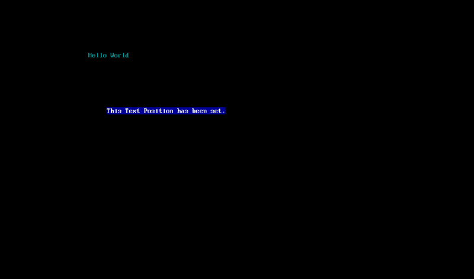

# ThatOSDev's EFI Library

This is the Unified Extensible Firmware Interface ( UEFI ) written from scratch. This is based off of the official UEFI 2.8b Specs PDF.

This can be freely used by anyone.

Examples are included.

**NOTE :** This has only been tested on windows with GCC 9.2 ( no cross-compiler needed )

MinGWx64 ( GCC )

https://nuwen.net/mingw.html

**Example : Keyboard Support**

**Example : Set Text Position and Colors**

**Example : Graphics**

**Example : PS/2 Mouse ( works with USB 1.1 and USB 2.0 )**

NOTE : This is a picture from my laptop. This doesn't work in VirtualBox.

       VirtualBox states that the EFI is experimental and most likely this is why  USB 3.0 support does not work.

**Example : Loading a File into memory and getting a number returned from the file.**

This picture shows the two folders used in this project.

The EFI\Boot\BOOTX64.EFI

and the ourOS\kernel.bin

This picture shows the stages of loading and getting the returned number.

